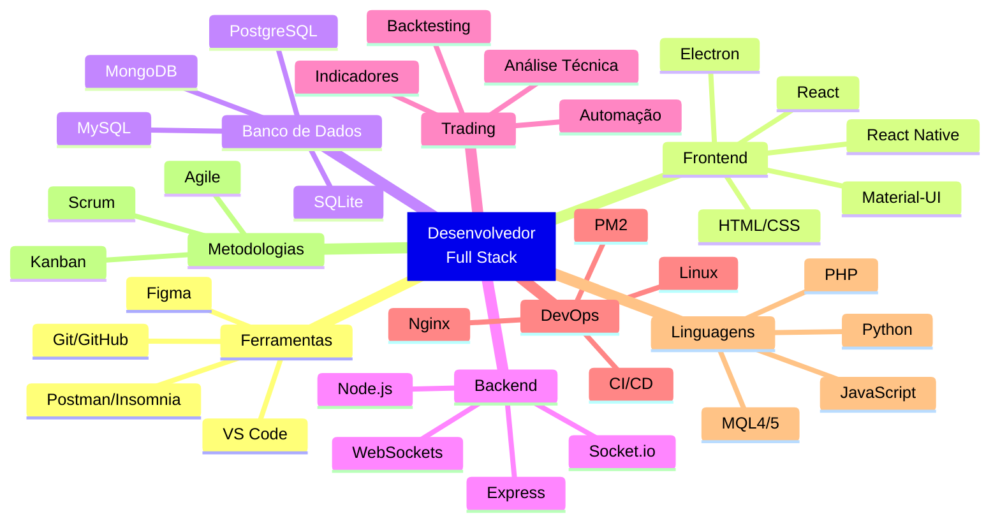
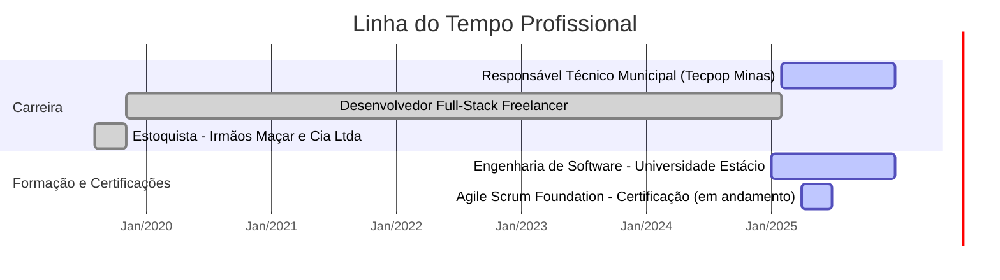
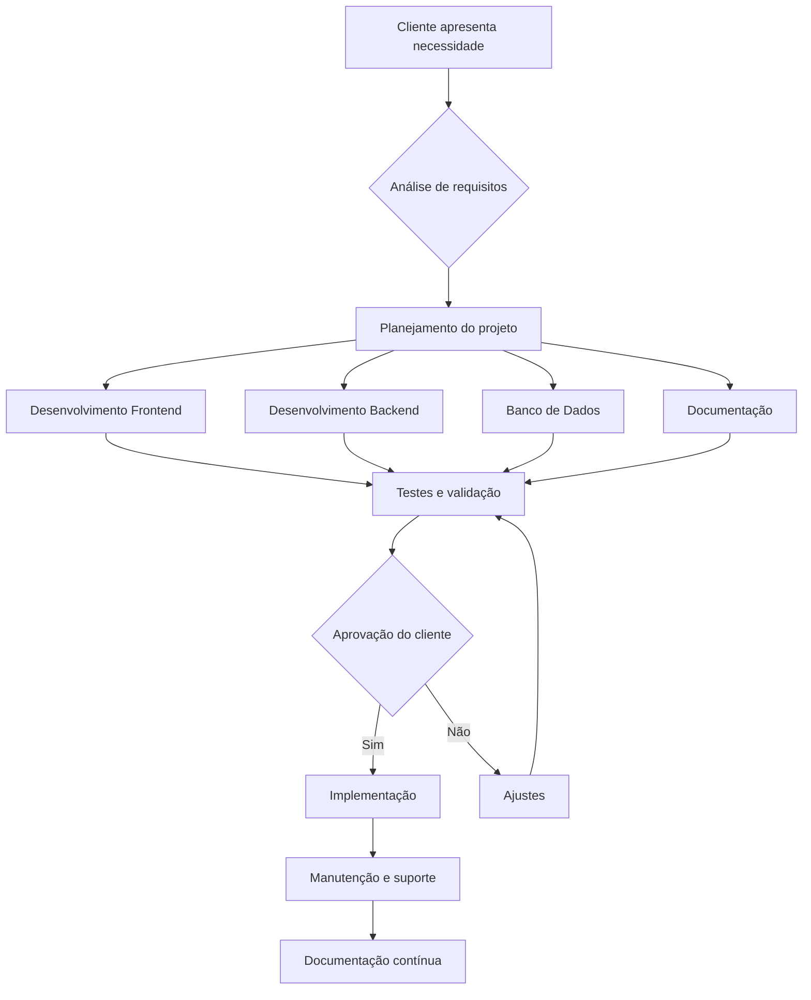
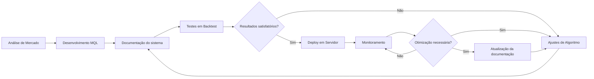

<h1 align="center">Aleson Pereira Pungirum</h1>

  

  
  
  
  
  

##  Aqui eu falo um pouco sobre mim

Eu sou desenvolvedor Full Stack e venho trabalhando com projetos web, mobile e também com sistemas de trading automatizados. Atualmente, estou cursando Engenharia de Software na Estácio. Gosto de usar tecnologia pra resolver problemas de forma prática — desenvolvendo sistemas que realmente ajudam as pessoas ou melhoram processos. Pra mim, o mais importante é entregar algo que funcione bem e faça sentido pra quem vai usar.
> Minha missão é **entregar valor através da tecnologia**, com soluções personalizadas, escaláveis e bem documentadas.
- Atualmente trabalho como Desenvolvedor Full-Stack Freelancer e Responsável Técnico Municipal
- Estou sempre buscando aprender e aplicar novas tecnologias
- Experiência em gerenciar projetos do início ao fim, assegurando prazos e satisfação
- Ladainha, MG - Brasil
- Habilitação categoria A (motos) e B (automóveis)
- Disponibilidade para viagens
##  Habilidades Interpessoais

- Comunicação clara
- Gestão de tempo
- Organização
- Atendimento ao cliente
- Resolução de problemas
- Pensamento lógico
- Proatividade
- Trabalho em equipe
- Foco em resultados
##  Mapa de Habilidades Técnicas

##  Meus Valores Profissionais

  
  
  
  

##  Habilidades Técnicas

### Linguagens de Programação

### Frontend

### Backend & DevOps

### Banco de Dados

### Ferramentas

### Metodologias de Gestão

## 📊 Timeline de Experiência Profissional

##  Formação Acadêmica

- **Bacharelado em Engenharia de Software** (em curso) | Universidade Estácio

##  Idiomas

- **Português:** Nativo
- **Inglês:** Intermediário (leitura técnica e escrita básica)
- **Espanhol:** Básico (comunicação simples)

##  Experiência Profissional

- **Coordenador** | Portal Tecpop Minas | Fev/2025 - Presente
  - Coordenação e ministração de aulas de informática 
  - Gestão completa da plataforma de cursos online no município
  - Cadastro e administração de cursos de tecnologia
  - Emissão de certificados e monitoramento de desempenho dos alunos
  - Implementação de estratégias educacionais para capacitação técnica

- **Desenvolvedor Full-Stack Freelancer** | Autônomo | Nov/2019 - Presente
  - Desenvolvimento de websites e aplicativos web
  - Implementação de soluções de banco de dados com MySQL
  - Desenvolvimento de sistemas de trading automatizados (MQL4 e MQL5)
  - Administração de servidores Linux e validação de APIs
  - Implementação de metodologias ágeis (Scrum/Kanban) para gerenciamento eficiente de projetos

- **Estoquista** | Irmãos Maçar e Cia Ltda | Ago/2019 - Out/2019
  - Gestão de inventário e controle de estoque
  - Desenvolvimento de habilidades em organização e gestão de tempo

##  Fluxograma de Desenvolvimento de Projetos

##  Diagrama de Sistemas de Trading

##  Como me encontrar

-  Email: [alesonperirapungirum@gmail.com](mailto:alesonperirapungirum@gmail.com)
-  WhatsApp: [+55 33 9999-11570](https://wa.me/5533999911570)
-  Ladainha, MG - Brasil

---

  Se meu trabalho foi útil para você, considere me pagar um café ☕
  
  
  

  Visitantes
   
  

